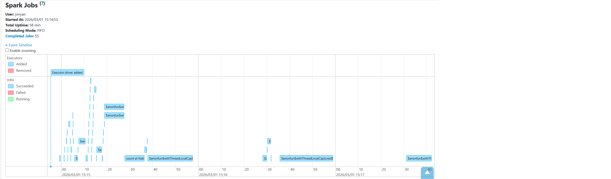

# Project 1

## DOCUMENTATION
Before starting the job:
create folder and add data to work/data/inbox

To run the job:  
``` docker compose up -d ```   
- http://localhost:8888 for Jupyter Notebook, token bdm
  
Run all cells  
- http://localhost:4040 for Spark UI (open after running the notebook)

### Transformations
#### Data cleaning rules
##### Timestamp validation
`tpep_pickup_datetime` must not be NULL.  
`tpep_dropoff_datetime` must not be NULL.  
`tpep_dropoff_datetime` must be greater than or equal to tpep_pickup_datetime.

##### Trip Distance Validation
`trip_distance` must not be NULL.  
`trip_distance` must be greater than 0.

##### Passenger Count Validation
`passenger_count` must not be NULL.  
`passenger_count` must be between 0 and 8 (inclusive).

##### Location Integrity
`PULocationID` must not be NULL.  
`DOLocationID` must not be NULL.

##### Monetary Field Handling
NULL values were replaced with 0.0.  
Values must be greater than or equal to 0.

Cleaned columns:  
`extra`  
`mta_tax`  
`tip_amount`  
`tolls_amount`  
`improvement_surcharge`  
`congestion_surcharge`  
`Airport_fee`  
`cbd_congestion_fee`  
*`fare_amount` NULL values were replaced with 0.0 (greater than check omitted due to custom scenario)  

##### Total Amount Validation
`total_amount` must not be NULL.  
`total_amount` must be greater than or equal to 0.  

#### Deduplication Key
The dataset does not provide a unique trip identifier. Composite key for deduplication:  
`VendorID`  
`tpep_pickup_datetime`  
`tpep_dropoff_datetime`  
`PULocationID`  
`DOLocationID`  
`trip_distance`  
`total_amount`  

### Incremental ingestion
#### Manifest
To enable incremental ingestion, a manifest file (state/manifest.json) is used to store metadata about processed input files. At runtime, the job reads the manifest file (if it exists). It lists all Parquet files in data/inbox/. Files already recorded in the manifest are skipped. Only new files are processed. The use of a manifest ensures idempotency. Re-running the job does not reprocess previously ingested files. Duplicate data is not introduced into the output. The pipeline remains deterministic and reproducible. After successfully processing new files, the manifest is updated to include their metadata. This ensures consistent state tracking across job executions.

##### The manifest records:
`filename` - name of the processed input file.  
`size_bytes` - file size in bytes at the time of processing.  
`raw_row_count` - number of rows read from the original input file before applying any transformations.  
`clean_row_count` - number of rows remaining after applying data cleaning rules.  
`after_dedup_row_count` - number of rows after duplicate removal.  
`processed_at` - timestamp indicating when the file was processed.

## REPORT
### Correctness
#### Row counts
**File: yellow_tripdata_2025-01.parquet**  
Input rows: 3,475,226  
After Cleaning Rows: 2,841,031  
After dedup Rows: 2,841,031  
Size: 59,158,238 bytes  
FINAL OUTPUT?  

Bad Row Examples  
*Example 1* - Invalid trip_distance (null or ≤0): 3 rows found
```
+-------------+--------------------+-----------+
|trip_distance|tpep_pickup_datetime|fare_amount|
+-------------+--------------------+-----------+
|0.0          |2025-01-01 00:49:48 |20.06      |
|0.0          |2025-01-01 00:37:43 |12.0       |
|0.0          |2025-01-01 00:57:08 |30.0       |
+-------------+--------------------+-----------+
```
Filtered out (trip_distance must be > 0)

*Example 2* - Time travel (dropoff before pickup): 3 rows found
```
+--------------------+---------------------+-------------+
|tpep_pickup_datetime|tpep_dropoff_datetime|trip_distance|
+--------------------+---------------------+-------------+
|2025-01-02 12:26:00 |2025-01-02 11:29:58  |9.0          |
|2025-01-06 16:00:00 |2025-01-06 15:05:30  |3.8          |
|2025-01-15 15:00:00 |2025-01-15 14:42:48  |1.0          |
+--------------------+---------------------+-------------+
```
Filtered out (dropoff must be >= pickup)

*Example 3* - Invalid passenger_count (outside 0-8): 3 rows found
```
+---------------+-------------+-----------+
|passenger_count|trip_distance|fare_amount|
+---------------+-------------+-----------+
|9              |31.97        |90.0       |
|9              |8.19         |90.0       |
|9              |4.43         |94.0       |
+---------------+-------------+-----------+
```
Filtered out (passenger_count must be 0-8)

**File: yellow_tripdata_2025-02.parquet**  
Input rows: 3,577,543  
After Cleaning Rows: 2,682,815  
After dedup Rows: 2,682,815  
Size: 60,343,086 bytes  
FINAL OUTPUT?

Bad Row Examples  
*Example 1* - Invalid trip_distance (null or ≤0): 3 rows found   
```
+-------------+--------------------+-----------+
|trip_distance|tpep_pickup_datetime|fare_amount|
+-------------+--------------------+-----------+
|0.0          |2025-02-01 00:30:36 |3.0        |
|0.0          |2025-02-01 00:35:53 |12.0       |
|0.0          |2025-02-01 00:24:49 |3.0        |
+-------------+--------------------+-----------+
```
Filtered out (trip_distance must be > 0)  

*Example 2* - Time travel (dropoff before pickup): 3 rows found
```
+--------------------+---------------------+-------------+
|tpep_pickup_datetime|tpep_dropoff_datetime|trip_distance|
+--------------------+---------------------+-------------+
|2025-02-01 14:45:00 |2025-02-01 13:49:59  |3.4          |
|2025-02-03 20:00:00 |2025-02-03 18:42:16  |10.7         |
|2025-02-04 13:00:00 |2025-02-04 12:44:50  |1.2          |
+--------------------+---------------------+-------------+
```
Filtered out (dropoff must be >= pickup)  

*Example 3* - Invalid passenger_count (outside 0-8): 3 rows found
```
+---------------+-------------+-----------+
|passenger_count|trip_distance|fare_amount|
+---------------+-------------+-----------+
|9              |0.0          |99.0       |
|9              |0.0          |-98.96     |
|9              |0.0          |98.96      |
+---------------+-------------+-----------+
```
Filtered out (passenger_count must be 0-8)  

### Performance
**Runtime for the full job:** 2 minutes 31 seconds  
**Total job/stage time from Spark UI**


**Shuffle read/write from Spark UI**


c. Two concrete optimization choices you tried, and what changed.

### Scenario
Please look at the code in [project1.ipynb](work/project1.ipynb) under "CUSTOM SCENARIO: Flag suspicious trips".
First the new column is added. Then the trips are marked accordingly, if they are suspicious (True) or not (False). Then suspicious trips are written to: data/outbox/suspicious_trips.parquet

**Counts**:  
Total trips: 5,523,846  
Suspicious trips found: 4,365
