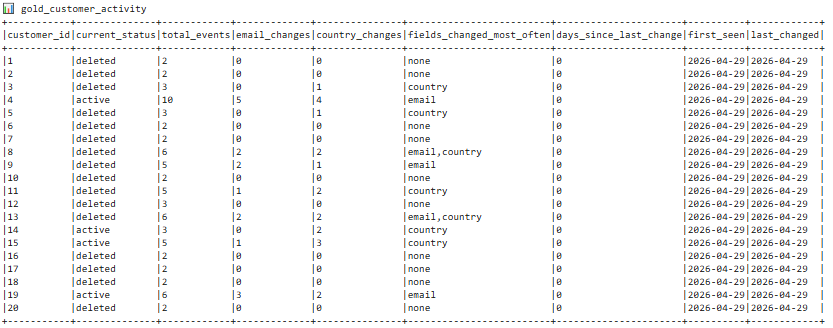
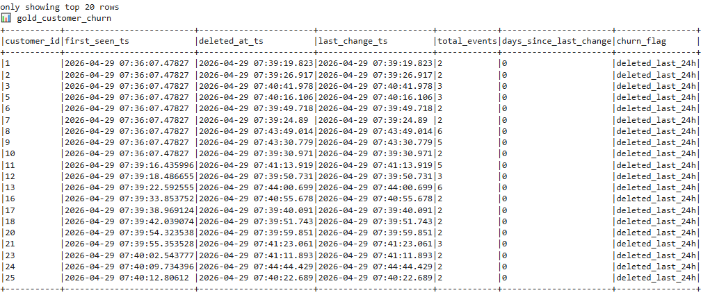

# Project 3 — CDC + Orchestrated Lakehouse Pipeline

## 1. CDC Correctness

### Merge logic documentation

The Silver layer applies CDC events using a MERGE operation based on the primary key (id):

If op = 'd', the corresponding row is deleted.
If op ∈ ('c','u','r'):
The row is updated if it already exists.
The row is inserted if it does not exist.

Before applying the MERGE, the pipeline deduplicates records using a window function to retain only the latest event per entity (ORDER BY ts_ms DESC).

### Idempotency

- Deduplication ensures only the latest event per key is processed, eliminating duplicate or outdated events.
- MERGE operates deterministically on primary keys, producing the same result for the same input.
- DELETE operations are safe to repeat, as deleting an already deleted row has no effect.
- UPDATE operations overwrite with the same values, resulting in no changes on re-execution.
- INSERT operations only occur when a row does not exist, preventing duplicate records.

Re-running the pipeline produces the same final state without duplications or inconsistencies.

### Silver matches PostgreSQL source (compare row counts; spot-check 3+ rows).

**Row count and spot-check lakehouse.cdc.silver_customers:**
```
spark.sql("SELECT COUNT(*) FROM lakehouse.cdc.silver_customers").show()
+--------+
|count(1)|
+--------+
|      10|
+--------+

spark.sql("SELECT COUNT(*) FROM lakehouse.cdc.silver_drivers").show()
+--------+
|count(1)|
+--------+
|       8|
+--------+
```
```
spark.sql("""SELECT * FROM lakehouse.cdc.silver_customers ORDER BY name ASC LIMIT 3 """).show(truncate=False)

+---+------------+-----------------+-------+---------------+
|id |name        |email            |country|last_updated_ms|
+---+------------+-----------------+-------+---------------+
|1  |Alice Mets  |alice@example.com|Estonia|1777484354013  |
|2  |Bob Virtanen|bob@example.com  |Finland|1777484354018  |
|3  |Carol Ozols |carol@example.com|Latvia |1777484354018  |
+---+------------+-----------------+-------+---------------+
```
Works also after running simulate.py some time and working hard to kill it:
```
spark.sql("SELECT COUNT(*) FROM lakehouse.cdc.silver_customers").show()
+--------+
|count(1)|
+--------+
|     120|
+--------+

spark.sql("SELECT COUNT(*) FROM lakehouse.cdc.silver_drivers").show()
+--------+
|count(1)|
+--------+
|      37|
+--------+

```


**Row count and spot-check PostgreSQL source:**
```
sourcedb=# SELECT COUNT(*) FROM customers;
 count 
-------
    10

sourcedb=# SELECT COUNT(*) FROM drivers;
 count 
-------
     8
```
```
sourcedb=# SELECT * FROM customers LIMIT 3;

 id |     name     |       email       | country |         created_at         
----+--------------+-------------------+---------+----------------------------
  1 | Alice Mets   | alice@example.com | Estonia | 2026-04-29 17:39:13.893333
  2 | Bob Virtanen | bob@example.com   | Finland | 2026-04-29 17:39:13.893333
  3 | Carol Ozols  | carol@example.com | Latvia  | 2026-04-29 17:39:13.893333
```
Works also after running simulate.py
```
sourcedb=# SELECT COUNT(*) FROM customers;
 count 
-------
   120
(1 row)

sourcedb=# SELECT COUNT(*) FROM drivers;
 count 
-------
    37
(1 row)

```


### DELETEs in PostgreSQL are reflected as absent rows in Silver

Delete a row in PostgreSQL: DELETE FROM customers WHERE id = 1; (User Alice Mets)

Silver table: spark.sql("SELECT * FROM lakehouse.cdc.silver_customers WHERE id = 1").show()
```
+---+----+-----+-------+---------------+
| id|name|email|country|last_updated_ms|
+---+----+-----+-------+---------------+
+---+----+-----+-------+---------------+
```
And previous query (SELECT * FROM lakehouse.cdc.silver_customers ORDER BY name ASC LIMIT 3). Alice Mets is no more there.
```
+---+--------------+-----------------+---------+---------------+
|id |name          |email            |country  |last_updated_ms|
+---+--------------+-----------------+---------+---------------+
|2  |Bob Virtanen  |bob@example.com  |Finland  |1777484354018  |
|3  |Carol Ozols   |carol@example.com|Latvia   |1777484354018  |
|4  |David Jonaitis|david@example.com|Lithuania|1777484354019  |
+---+--------------+-----------------+---------+---------------+
```

### Idempotency: running the DAG twice with no new changes leaves Silver unchanged (show row counts).

After running CDC bronze and silver layer 5 times and quering more than 1 time existing ID-s:
```
spark.sql("""SELECT id, COUNT(*) FROM lakehouse.cdc.silver_customers GROUP BY id HAVING COUNT(*) > 1""").show()
```

```
+---+--------+
| id|count(1)|
+---+--------+
+---+--------+
```

## 2. Lakehouse Design

### Schema of each table: Bronze CDC, Silver CDC, Bronze taxi, Silver taxi, Gold — and why each differs from the previous layer.

#### Bronze CDC, Silver CDC
Tabels differ, because bronze layer has all raw rows Debezium. Silver layer has table for customers and drivers and the data is cleaned. Silver layer stores latest state per entity. 

```
lakehouse.cdc.bronze_cdc
root
 |-- topic: string (nullable = true)
 |-- kafka_partition: integer (nullable = true)
 |-- kafka_offset: long (nullable = true)
 |-- kafka_timestamp: timestamp (nullable = true)
 |-- op: string (nullable = true)
 |-- ts_ms: long (nullable = true)
 |-- lsn: long (nullable = true)
 |-- before: string (nullable = true)
 |-- after: string (nullable = true)
```

```
lakehouse.cdc.silver_customers
 |-- id: integer (nullable = true)
 |-- name: string (nullable = true)
 |-- email: string (nullable = true)
 |-- country: string (nullable = true)
 |-- last_updated_ms: long (nullable = true)
```

```
lakehouse.cdc.silver_drivers
root
 |-- id: integer (nullable = true)
 |-- name: string (nullable = true)
 |-- license_number: string (nullable = true)
 |-- rating: double (nullable = true)
 |-- city: string (nullable = true)
 |-- active: boolean (nullable = true)
 |-- created_at: string (nullable = true)
 |-- last_updated_ms: long (nullable = true)
```

#### Bronze taxi, Silver taxi, Gold taxi
Tables differ because each layer increases structure and business meaning. Bronze keeps the raw parquet columns plus a generated trip_id, Silver cleans types, removes invalid rows, and enriches with zone names, Gold aggregates for analytics.

```
lakehouse.taxi.bronze_trips
root
 |-- VendorID: integer (nullable = true)
 |-- tpep_pickup_datetime: string (nullable = true)
 |-- tpep_dropoff_datetime: string (nullable = true)
 |-- passenger_count: double (nullable = true)
 |-- trip_distance: double (nullable = true)
 |-- RatecodeID: double (nullable = true)
 |-- store_and_fwd_flag: string (nullable = true)
 |-- PULocationID: integer (nullable = true)
 |-- DOLocationID: integer (nullable = true)
 |-- payment_type: integer (nullable = true)
 |-- fare_amount: double (nullable = true)
 |-- extra: double (nullable = true)
 |-- mta_tax: double (nullable = true)
 |-- tip_amount: double (nullable = true)
 |-- tolls_amount: double (nullable = true)
 |-- improvement_surcharge: double (nullable = true)
 |-- total_amount: double (nullable = true)
 |-- congestion_surcharge: double (nullable = true)
 |-- Airport_fee: double (nullable = true)
 |-- cbd_congestion_fee: double (nullable = true)
 |-- trip_id: long (nullable = true)
```

```
lakehouse.taxi.silver_trips
root
 |-- trip_id: long (nullable = true)
 |-- vendor_id: integer (nullable = true)
 |-- pickup_datetime: timestamp (nullable = true)
 |-- dropoff_datetime: timestamp (nullable = true)
 |-- passenger_count: integer (nullable = true)
 |-- trip_distance: double (nullable = true)
 |-- rate_code_id: integer (nullable = true)
 |-- store_and_fwd_flag: string (nullable = true)
 |-- pu_location_id: integer (nullable = true)
 |-- do_location_id: integer (nullable = true)
 |-- payment_type: integer (nullable = true)
 |-- fare_amount: double (nullable = true)
 |-- extra: double (nullable = true)
 |-- mta_tax: double (nullable = true)
 |-- tip_amount: double (nullable = true)
 |-- tolls_amount: double (nullable = true)
 |-- improvement_surcharge: double (nullable = true)
 |-- total_amount: double (nullable = true)
 |-- congestion_surcharge: double (nullable = true)
 |-- airport_fee: double (nullable = true)
 |-- cbd_congestion_fee: double (nullable = true)
 |-- pickup_zone: string (nullable = true)
 |-- pickup_borough: string (nullable = true)
 |-- dropoff_zone: string (nullable = true)
 |-- dropoff_borough: string (nullable = true)
```

```
lakehouse.taxi.gold_hourly_trips
root
 |-- pickup_zone: string (nullable = true)
 |-- hour: timestamp (nullable = true)
 |-- trip_count: long (nullable = true)
 |-- avg_fare: double (nullable = true)
 |-- avg_distance: double (nullable = true)
```

#### Iceberg snapshot history for Silver CDC (query showing multiple MERGE snapshots).
```
spark.sql("SELECT * FROM lakehouse.cdc.silver_customers.history").show()
+--------------------+-------------------+-------------------+-------------------+
|     made_current_at|        snapshot_id|          parent_id|is_current_ancestor|
+--------------------+-------------------+-------------------+-------------------+
|2026-05-01 08:48:...|6007516179617277881|               NULL|               true|
|2026-05-01 11:22:...|7939841747190356258|6007516179617277881|               true|
|2026-05-01 11:29:...|1475400092160512281|7939841747190356258|               true|
+--------------------+-------------------+-------------------+-------------------+
```

#### Time-travel: Silver CDC at a snapshot before a first MERGE.

Getting current snapshot ID's:
```
spark.sql("SELECT snapshot_id, made_current_at FROM lakehouse.cdc.silver_customers.history").show()
+-------------------+--------------------+
|        snapshot_id|     made_current_at|
+-------------------+--------------------+
|6007516179617277881|2026-05-01 08:48:...|
|7939841747190356258|2026-05-01 11:22:...|
|1475400092160512281|2026-05-01 11:29:...|
+-------------------+--------------------+
```
Quering snapshot whit ID 6007516179617277881 (first snapshot before starting simulate.py).
```
spark.sql("SELECT * FROM lakehouse.cdc.silver_customers VERSION AS OF 7939841747190356258").show()
+---+--------------+------------------+-----------+---------------+
| id|          name|             email|    country|last_updated_ms|
+---+--------------+------------------+-----------+---------------+
|  6|  Frank Muller| frank@example.com|    Germany|  1777624988039|
|  9| Ingrid Larsen|ingrid@example.com|     Norway|  1777624988040|
| 10| Javier Garcia|javier@example.com|      Spain|  1777624988040|
|  2|  Bob Virtanen|   bob@example.com|    Finland|  1777624988036|
|  4|David Jonaitis| david@example.com|  Lithuania|  1777624988038|
|  5|  Eva Svensson|   eva@example.com|     Sweden|  1777624988038|
|  1|    Alice Mets| alice@example.com|    Estonia|  1777624988021|
|  3|   Carol Ozols| carol@example.com|     Latvia|  1777624988037|
|  7|     Grace Kim| grace@example.com|South Korea|  1777624988039|
|  8|   Hiro Tanaka|  hiro@example.com|      Japan|  1777624988039|
+---+--------------+------------------+-----------+---------------+
```


## 3. Orchestration Design

### **DAG Structure**

The Airflow DAG orchestrates two parallel pipelines with **7 tasks**:

**CDC Pipeline:**
```
connector_health → run_bronze_cdc → run_silver_cdc → run_gold_customer_activity
```

**Taxi Pipeline:**
```
run_bronze_taxi → run_silver_taxi → run_gold_taxi
```


---

### **Task Descriptions**

| Task | Type | Purpose |
|------|------|---------|
| `connector_health` | HttpSensor | Checks Debezium connector is RUNNING before CDC tasks execute |
| `run_bronze_cdc` | BashOperator | Reads CDC events from Kafka → `lakehouse.cdc.bronze_cdc` |
| `run_silver_cdc` | BashOperator | Applies MERGE logic → `lakehouse.cdc.silver_customers/drivers` |
| **`run_gold_customer_activity`** | **BashOperator** | **Custom scenario: customer lifecycle tracking → `lakehouse.cdc.gold_customer_activity` & `gold_customer_churn`** |
| `run_bronze_taxi` | BashOperator | Loads parquet with trip_id → `lakehouse.taxi.bronze_trips` |
| `run_silver_taxi` | BashOperator | Cleans, filters, enriches with zones → `lakehouse.taxi.silver_trips` |
| `run_gold_taxi` | BashOperator | Hourly aggregations by zone → `lakehouse.taxi.gold_hourly_trips` |

---

### **Scheduling**

**Schedule:** `None` (manual trigger)

Manual triggering provides full control for testing and avoids overwhelming the local Docker environment. In production, this would use `schedule='@hourly'` to support a 1-hour freshness SLA.

---

### **Retry Configuration**

```python
'retries': 1,
'retry_delay': timedelta(minutes=2)
```

Each task automatically retries once after 2 minutes if it fails, handling transient network or resource issues.

---

### **Idempotency**

The pipeline is idempotent through:
- **Bronze:** Append-only (duplicates handled in Silver)
- **Silver CDC:** MERGE with deduplication by latest `ts_ms`
- **Silver Taxi:** `createOrReplace()` with consistent filtering
- **Gold (Taxi & Customer Activity):** Aggregations recalculated from Silver using `createOrReplace()`

Re-running produces the same final state with no duplicates.

---

### **DAG Run History**


| Run | Start Time (UTC) | Duration | Status |
|-----|-----------------|----------|---------|
| 1 | 14:11:17 | 8m 10s | ✅ Success |
| 2 | 14:20:56 | 8m 13s | ✅ Success |
| 3 | 14:31:07 | 9m 21s | ✅ Success |

All 7 tasks (including the custom customer activity scenario) completed successfully across multiple consecutive runs.

---

### **Failure Handling Example**

**Problem:** `run_silver_taxi` failed with `OutOfMemoryError` on 2.8M records.

**Root Cause:** Driver memory set in Python code was ignored (must be set at JVM startup).

**Solution:**
- Added `--driver-memory 3g` to spark-submit command
- Implemented broadcast joins for zone lookups (eliminates shuffle)
- Tuned: `local[2]`, `shuffle.partitions=50`

After optimization, task succeeded consistently. Airflow's retry mechanism handled failures during debugging.

**Additional Issue:** `run_gold_customer_activity` initially failed due to missing S3 credentials in Spark configuration. Fixed by adding `s3.access-key-id` and `s3.secret-access-key` configs matching the working `taxi_gold.py` implementation.

## 4. Taxi Pipeline

### Bronze taxi

Bronze reads from the parquet trip data and stores the raw columns with a generated `trip_id` for downstream joins. The schema is kept close to the source file to preserve all raw fields.

Key properties:
- Append-only Iceberg table
- Generated `trip_id` (monotonically increasing)
- No cleaning or filtering

### Silver taxi

Silver parses and cleans the raw records and enriches with zone names. Cleaning steps:
- Parse `pickup_datetime` and `dropoff_datetime` into timestamps
- Cast numeric fields (`passenger_count`, `trip_distance`, `fare_amount`, `total_amount`)
- Drop invalid rows (negative distance/fare, missing timestamps, zero passengers)
- Enrich with taxi zone lookup to add `pickup_zone` and `dropoff_zone`

Improvement over Project 2:
- Added de-duplication on a stable key (`vendor_id`, `pickup_datetime`, `pu_location_id`, `do_location_id`, `fare_amount`) to prevent duplicates from replays.

### Gold taxi

Gold aggregates Silver for analytics. The job computes hourly demand per pickup zone and average fare and distance:

- `pickup_hour` = date_trunc('hour', pickup_datetime)
- `trip_count` per hour and zone
- `avg_fare` and `avg_distance` for trend analysis

Gold tables are recreated from Silver on each run, so re-running the DAG is idempotent and produces the same aggregates for the same input.

### Taxi correctness (queries and outputs)

**Bronze row count and sample:**
```
spark.sql("SELECT COUNT(*) FROM lakehouse.taxi.bronze_trips").show()
spark.sql("SELECT VendorID, tpep_pickup_datetime, PULocationID, DOLocationID, total_amount FROM lakehouse.taxi.bronze_trips LIMIT 5").show(truncate=False)

+-------+
|  count|
+-------+
|3475226|
+-------+

+--------+--------------------+------------+------------+------------+
|VendorID|tpep_pickup_datetime|PULocationID|DOLocationID|total_amount|
+--------+--------------------+------------+------------+------------+
|1       |2025-01-01 00:18:38 |229         |237         |18.0        |
|1       |2025-01-01 00:32:40 |236         |237         |12.12       |
|1       |2025-01-01 00:44:04 |141         |141         |12.1        |
|2       |2025-01-01 00:14:27 |244         |244         |9.7         |
|2       |2025-01-01 00:21:34 |244         |116         |8.3         |
+--------+--------------------+------------+------------+------------+
```

**Silver row count and sample:**
```
spark.sql("SELECT COUNT(*) FROM lakehouse.taxi.silver_trips").show()
spark.sql("SELECT trip_id, pickup_datetime, dropoff_datetime, pickup_zone, dropoff_zone, total_amount FROM lakehouse.taxi.silver_trips LIMIT 5").show(truncate=False)

+-------+
|  count|
+-------+
|2815410|
+-------+

+-----------+-------------------+-------------------+-----------------------+-------------------------+------------+
|trip_id    |pickup_datetime    |dropoff_datetime   |pickup_zone            |dropoff_zone             |total_amount|
+-----------+-------------------+-------------------+-----------------------+-------------------------+------------+
|51539927419|2025-01-15 23:51:44|2025-01-16 00:27:12|Newark Airport         |Times Sq/Theatre District|102.01      |
|17179895943|2025-01-01 09:40:38|2025-01-01 09:50:33|Allerton/Pelham Gardens|Eastchester              |17.0        |
|17179894742|2025-01-01 08:29:15|2025-01-01 09:06:27|Allerton/Pelham Gardens|Bronxdale                |18.0        |
|17179958933|2025-01-02 10:59:23|2025-01-02 11:16:04|Allerton/Pelham Gardens|Van Nest/Morris Park     |20.0        |
|85899882621|2025-01-29 09:13:03|2025-01-29 09:42:18|Allerton/Pelham Gardens|Van Nest/Morris Park     |23.0        |
+-----------+-------------------+-------------------+-----------------------+-------------------------+------------+
```

**Gold aggregates sample:**
```
spark.sql("SELECT COUNT(*) FROM lakehouse.taxi.gold_hourly_trips").show()
spark.sql("SELECT pickup_zone, hour, trip_count, avg_fare, avg_distance FROM lakehouse.taxi.gold_hourly_trips ORDER BY hour DESC LIMIT 5").show(truncate=False)

+-----+
|count|
+-----+
|72847|
+-----+

+-----------------------+-------------------+----------+--------+------------+
|pickup_zone            |hour               |trip_count|avg_fare|avg_distance|
+-----------------------+-------------------+----------+--------+------------+
|Greenwich Village North|2025-02-01 00:00:00|1         |6.5     |1.04        |
|Seaport                |2025-01-31 23:00:00|11        |15.98   |2.75        |
|TriBeCa/Civic Center   |2025-01-31 23:00:00|86        |14.83   |2.54        |
|Gramercy               |2025-01-31 23:00:00|171       |13.39   |2.1         |
|Alphabet City          |2025-01-31 23:00:00|30        |13.94   |2.25        |
+-----------------------+-------------------+----------+--------+------------+
```

## 5. Custom Scenario

This pipeline processes raw CDC events from `lakehouse.cdc.bronze_cdc` and builds customer activity and churn tables.

The pipeline first filters the raw CDC stream to include only customer topic events. For each event, it extracts `entity_id` from either the `after` or `before` JSON payload, depending on the operation type.

Field-level changes are detected using a window function ordered by `ts_ms`. Each row’s `after` JSON is compared with the previous row for the same customer, allowing the pipeline to detect changes in individual fields, including:

- `email`
- `country`

The aggregation layer then groups records by `entity_id` and computes lifecycle-level customer metrics. The `first_seen_ts` value is derived from the original database `created_at` timestamp, stored in microseconds, rather than from the Debezium ingestion timestamp. This ensures that the original business timestamps are preserved.

Customer status is determined by joining against `silver_customers`. However, deletion history takes priority: if a customer was ever deleted, they are marked as deleted even if they still appear in `silver_customers`.

#### Results

The pipeline produced **1,156 customer activity records** and correctly identified **48 churned customers**, matching the **48 delete events** generated by the simulator.

The query output for `gold_customer_activity` is available in the notebook [`gold_customer_activity.ipynb`](gold_customer_activity.ipynb). To keep the terminal output clean, the print statement was removed from `gold_customer_activity.py`.

#### Gold Customer activity table



#### Gold Customer Churn table




---