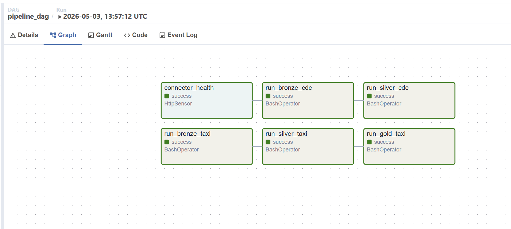
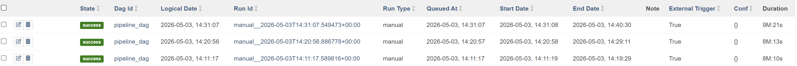

# Project 3 — CDC + Orchestrated Lakehouse Pipeline

## 1. CDC Correctness

### Merge logic documentation

The Silver layer applies CDC events using a MERGE operation based on the primary key (id):

If op = 'd', the corresponding row is deleted.
If op ∈ ('c','u','r'):
The row is updated if it already exists.
The row is inserted if it does not exist.

Before applying the MERGE, the pipeline deduplicates records using a window function to retain only the latest event per entity (ORDER BY ts_ms DESC).

### Idempotency

- Deduplication ensures only the latest event per key is processed, eliminating duplicate or outdated events.
- MERGE operates deterministically on primary keys, producing the same result for the same input.
- DELETE operations are safe to repeat, as deleting an already deleted row has no effect.
- UPDATE operations overwrite with the same values, resulting in no changes on re-execution.
- INSERT operations only occur when a row does not exist, preventing duplicate records.

Re-running the pipeline produces the same final state without duplications or inconsistencies.

### Silver matches PostgreSQL source (compare row counts; spot-check 3+ rows).

**Row count and spot-check lakehouse.cdc.silver_customers:**
```
spark.sql("SELECT COUNT(*) FROM lakehouse.cdc.silver_customers").show()
+--------+
|count(1)|
+--------+
|      10|
+--------+

spark.sql("SELECT COUNT(*) FROM lakehouse.cdc.silver_drivers").show()
+--------+
|count(1)|
+--------+
|       8|
+--------+
```
```
spark.sql("""SELECT * FROM lakehouse.cdc.silver_customers ORDER BY name ASC LIMIT 3 """).show(truncate=False)

+---+------------+-----------------+-------+---------------+
|id |name        |email            |country|last_updated_ms|
+---+------------+-----------------+-------+---------------+
|1  |Alice Mets  |alice@example.com|Estonia|1777484354013  |
|2  |Bob Virtanen|bob@example.com  |Finland|1777484354018  |
|3  |Carol Ozols |carol@example.com|Latvia |1777484354018  |
+---+------------+-----------------+-------+---------------+
```
Works also after running simulate.py some time and working hard to kill it:
```
spark.sql("SELECT COUNT(*) FROM lakehouse.cdc.silver_customers").show()
+--------+
|count(1)|
+--------+
|     120|
+--------+

spark.sql("SELECT COUNT(*) FROM lakehouse.cdc.silver_drivers").show()
+--------+
|count(1)|
+--------+
|      37|
+--------+

```


**Row count and spot-check PostgreSQL source:**
```
sourcedb=# SELECT COUNT(*) FROM customers;
 count 
-------
    10

sourcedb=# SELECT COUNT(*) FROM drivers;
 count 
-------
     8
```
```
sourcedb=# SELECT * FROM customers LIMIT 3;

 id |     name     |       email       | country |         created_at         
----+--------------+-------------------+---------+----------------------------
  1 | Alice Mets   | alice@example.com | Estonia | 2026-04-29 17:39:13.893333
  2 | Bob Virtanen | bob@example.com   | Finland | 2026-04-29 17:39:13.893333
  3 | Carol Ozols  | carol@example.com | Latvia  | 2026-04-29 17:39:13.893333
```
Works also after running simulate.py
```
sourcedb=# SELECT COUNT(*) FROM customers;
 count 
-------
   120
(1 row)

sourcedb=# SELECT COUNT(*) FROM drivers;
 count 
-------
    37
(1 row)

```


### DELETEs in PostgreSQL are reflected as absent rows in Silver

Delete a row in PostgreSQL: DELETE FROM customers WHERE id = 1; (User Alice Mets)

Silver table: spark.sql("SELECT * FROM lakehouse.cdc.silver_customers WHERE id = 1").show()
```
+---+----+-----+-------+---------------+
| id|name|email|country|last_updated_ms|
+---+----+-----+-------+---------------+
+---+----+-----+-------+---------------+
```
And previous query (SELECT * FROM lakehouse.cdc.silver_customers ORDER BY name ASC LIMIT 3). Alice Mets is no more there.
```
+---+--------------+-----------------+---------+---------------+
|id |name          |email            |country  |last_updated_ms|
+---+--------------+-----------------+---------+---------------+
|2  |Bob Virtanen  |bob@example.com  |Finland  |1777484354018  |
|3  |Carol Ozols   |carol@example.com|Latvia   |1777484354018  |
|4  |David Jonaitis|david@example.com|Lithuania|1777484354019  |
+---+--------------+-----------------+---------+---------------+
```

### Idempotency: running the DAG twice with no new changes leaves Silver unchanged (show row counts).

After running CDC bronze and silver layer 5 times and quering more than 1 time existing ID-s:
```
spark.sql("""
SELECT id, COUNT(*) 
FROM lakehouse.cdc.silver_customers
GROUP BY id
HAVING COUNT(*) > 1
""").show()
```

```
+---+--------+
| id|count(1)|
+---+--------+
+---+--------+
```

## 2. Lakehouse Design

## 3. Orchestration Design

### **DAG Structure**

The Airflow DAG orchestrates two parallel pipelines with 6 tasks:

**CDC Pipeline:**
```
connector_health → run_bronze_cdc → run_silver_cdc
```

**Taxi Pipeline:**
```
run_bronze_taxi → run_silver_taxi → run_gold_taxi
```



---

### **Task Descriptions**

| Task | Type | Purpose |
|------|------|---------|
| `connector_health` | HttpSensor | Checks Debezium connector is RUNNING before CDC tasks execute |
| `run_bronze_cdc` | BashOperator | Reads CDC events from Kafka → `lakehouse.cdc.bronze_cdc` |
| `run_silver_cdc` | BashOperator | Applies MERGE logic → `lakehouse.cdc.silver_customers/drivers` |
| `run_bronze_taxi` | BashOperator | Loads parquet with trip_id → `lakehouse.taxi.bronze_trips` |
| `run_silver_taxi` | BashOperator | Cleans, filters, enriches with zones → `lakehouse.taxi.silver_trips` |
| `run_gold_taxi` | BashOperator | Hourly aggregations by zone → `lakehouse.taxi.gold_hourly_trips` |

---

### **Scheduling**

**Schedule:** `None` (manual trigger)

Manual triggering provides full control for testing and avoids overwhelming the local Docker environment. In production, this would use `schedule='@hourly'` to support a 1-hour freshness SLA.

---

### **Retry Configuration**

```python
'retries': 1,
'retry_delay': timedelta(minutes=2)
```

Each task automatically retries once after 2 minutes if it fails, handling transient network or resource issues.

---

### **Idempotency**

The pipeline is idempotent through:
- **Bronze:** Append-only (duplicates handled in Silver)
- **Silver CDC:** MERGE with deduplication by latest `ts_ms`
- **Silver Taxi:** `createOrReplace()` with consistent filtering
- **Gold:** Aggregations recalculated from Silver

Re-running produces the same final state with no duplicates.

---

### **DAG Run History**



| Run | Start Time (UTC) | Duration | Status |
|-----|-----------------|----------|---------|
| 1 | 14:11:17 | 8m 10s | ✅ Success |
| 2 | 14:20:56 | 8m 13s | ✅ Success |
| 3 | 14:31:07 | 9m 21s | ✅ Success |

All 6 tasks completed successfully across 3 consecutive runs.

---

### **Failure Handling Example**

**Problem:** `run_silver_taxi` failed with `OutOfMemoryError` on 2.8M records.

**Root Cause:** Driver memory set in Python code was ignored (must be set at JVM startup).

**Solution:**
- Added `--driver-memory 3g` to spark-submit command
- Implemented broadcast joins for zone lookups (eliminates shuffle)
- Tuned: `local[2]`, `shuffle.partitions=50`

After optimization, task succeeded consistently. Airflow's retry mechanism handled failures during debugging.

## 4. Taxi Pipeline

## 5. Custom Scenario

The pipeline reads raw CDC events from lakehouse.cdc.bronze_cdc, filters for customer topic events, and extracts the entity_id from either the after or before JSON depending on the operation type. A window function ordered by ts_ms detects field-level changes by comparing each row's after JSON against the previous row's, flagging email and country changes individually. The aggregation layer groups by entity_id to compute first_seen_ts from the real database created_at timestamp (in microseconds) rather than the Debezium ingestion time, ensuring 2025 business dates are preserved instead of the 2026 replay timestamps. Current status is determined by joining against silver_customers — but ever_deleted takes priority, so a customer who was deleted but still appears in silver is correctly marked as deleted. The gold_customer_activity table captures the full customer lifecycle including total events, field change counts, days since last change, and deletion metadata, while gold_customer_churn materializes as an Iceberg table (since the REST catalog doesn't support views) filtering for customers deleted in the last 24 hours or inactive for 7+ days. The pipeline produced 1156 activity records and correctly identified 48 churned customers matching exactly the 48 delete events generated by the simulator.

