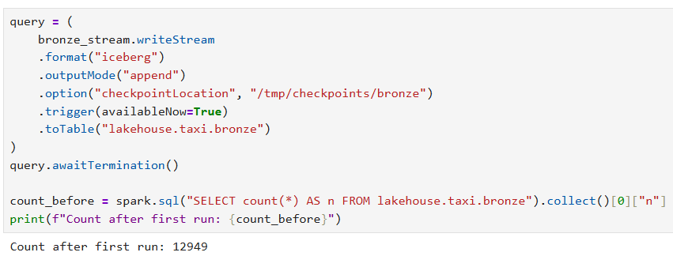
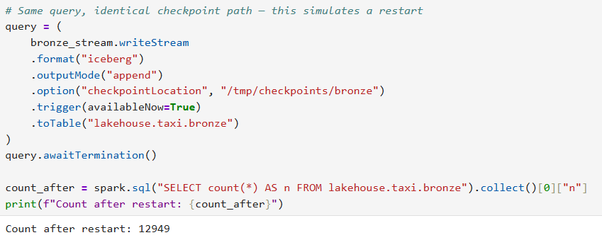
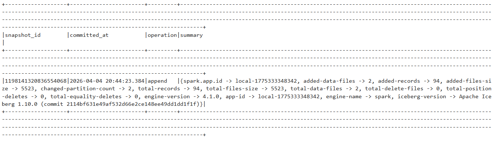
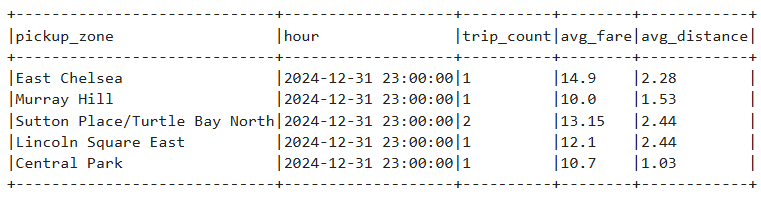
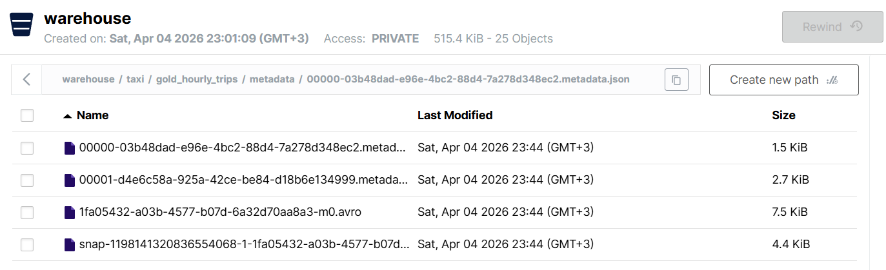

# Project 2: Streaming Lakehouse Pipeline

## 1. Medallion layer schemas

### Bronze

**Iceberg table schema (`lakehouse.taxi.bronze`):**

```sql
CREATE TABLE lakehouse.taxi.bronze (
    key             STRING,
    value           STRING,
    topic           STRING,
    partition       INT,
    offset          BIGINT,
    kafka_timestamp TIMESTAMP
)
USING iceberg;
```

| Column | Type | Notes |
|---|---|---|
| `key` | STRING | Kafka message key |
| `value` | STRING | Raw JSON payload — unparsed |
| `topic` | STRING | Source topic name |
| `partition` | INT | Kafka partition number |
| `offset` | BIGINT | Kafka offset |
| `kafka_timestamp` | TIMESTAMP | Broker-assigned ingestion time |

**Why kept as-is:** Bronze is a verbatim, append-only record of every Kafka event. The raw JSON is preserved so any downstream parsing mistake can be corrected by re-deriving silver/gold without re-consuming from Kafka. No business logic is applied at this layer.

---

### Silver

```python
# After parsing JSON, casting types, filtering, deduplicating and joining zones:
StructType([
    StructField("vendor_id",             IntegerType()),
    StructField("pickup_datetime",        TimestampType()),
    StructField("dropoff_datetime",       TimestampType()),
    StructField("passenger_count",        IntegerType()),
    StructField("trip_distance",          DoubleType()),
    StructField("rate_code_id",           IntegerType()),
    StructField("store_and_fwd_flag",     StringType()),
    StructField("pu_location_id",         IntegerType()),
    StructField("do_location_id",         IntegerType()),
    StructField("payment_type",           IntegerType()),
    StructField("fare_amount",            DoubleType()),
    StructField("extra",                  DoubleType()),
    StructField("mta_tax",                DoubleType()),
    StructField("tip_amount",             DoubleType()),
    StructField("tolls_amount",           DoubleType()),
    StructField("improvement_surcharge",  DoubleType()),
    StructField("total_amount",           DoubleType()),
    StructField("congestion_surcharge",   DoubleType()),
    StructField("airport_fee",            DoubleType()),
    StructField("cbd_congestion_fee",     DoubleType()),
    StructField("kafka_timestamp",        TimestampType()),
    StructField("pickup_zone",            StringType()),   # enriched
    StructField("pickup_borough",         StringType()),   # enriched
    StructField("dropoff_zone",           StringType()),   # enriched
    StructField("dropoff_borough",        StringType()),   # enriched
])
```

**What changed vs Bronze:**
- Raw `value` JSON string is **parsed** into typed columns using an explicit schema.
- All string timestamps are cast to `TimestampType`.
- Invalid rows are **filtered out**.
- Duplicates are **removed** on a composite business key.
- Opaque integer location IDs are **replaced** with human-readable zone/borough names via a join.

---

### Gold

```sql
CREATE OR REPLACE TABLE lakehouse.taxi.gold_hourly_trips (
    pickup_zone     STRING,
    hour            TIMESTAMP,
    trip_count      BIGINT,
    avg_fare        DOUBLE,
    avg_distance    DOUBLE
)
USING iceberg
PARTITIONED BY (days(hour))
```

**Aggregation logic:** Silver rows are grouped by `pickup_zone` and a truncated hourly bucket (`date_trunc("hour", pickup_datetime)`). For each group the pipeline computes `count(*)` as `trip_count`, `avg(fare_amount)` as `avg_fare`, and `avg(trip_distance)` as `avg_distance`. This collapses ~22 columns of individual trip records into a 5-column analytical summary optimised for time-series dashboards.

---

## 2. Streaming configuration

- **Checkpoint path:** `/tmp/checkpoints/bronze`
  Stores Kafka offsets committed per partition, batch metadata, and stream identity. After every micro-batch Spark writes the offsets it consumed; on restart it reads those offsets and resumes from exactly the next one — guaranteeing no message is re-processed or skipped.

- **Trigger:** `trigger(availableNow=True)`
  Processes all messages available in Kafka at job start time, then stops. This is a one-shot bounded run suitable for batch-style execution (e.g. scheduled via cron or a notebook). It does **not** mean a single micro-batch — Spark still splits work internally. In this run it produced **3 micro-batches**, one per Kafka partition (partitions 0, 1, 2).


_Screenshot of checkpoint folder and assertion output:_





---

## 3. Gold table partitioning strategy

```sql
PARTITIONED BY (days(hour))
```

The gold table is partitioned by the **day component** of the `hour` column using Iceberg's built-in `days()` transform.

**Why this column:** All analytical queries filter by date range (e.g. "trips in the last 7 days", "compare weekday vs weekend"). Partitioning on `days(hour)` means Spark can skip entire day-level directories for out-of-range dates via partition pruning — no full table scan needed.


**Snapshot history query:**
```sql
SELECT snapshot_id, committed_at, operation, summary
FROM lakehouse.taxi.gold_hourly_trips.snapshots
ORDER BY committed_at;
```
_Screenshot of snapshot history output:_




```sql
SELECT *
FROM lakehouse.taxi.gold_hourly_trips
FOR VERSION AS OF 1198141320836554068
LIMIT 5;
```

_Screenshot of time travel to the exact snapshot we already have:_




_Screenshot of minio UI:_




---

## 4. Custom scenario

**Problem:** 

**Solution:** 


---

## 5. How to run

```bash
# Step 1: Start infrastructure (Kafka, MinIO, Iceberg REST catalog)
docker compose up -d

# Step 2: Wait for services to be healthy, then produce data
python produce.py

# Step 3: Open JupyterLab and run the notebook
# Navigate to http://localhost:8888 and open main-test_gold.ipynb
# Run all cells top to bottom
```

**Dependencies:** All Python and Spark dependencies are bundled in the Docker image (`pyspark-notebook:2025-12-31`, Spark 4.1.0). No local pip installs are required.

**`.env` values for the grader:**

```env
AWS_ACCESS_KEY_ID=minioadmin
AWS_SECRET_ACCESS_KEY=minioadmin
```
